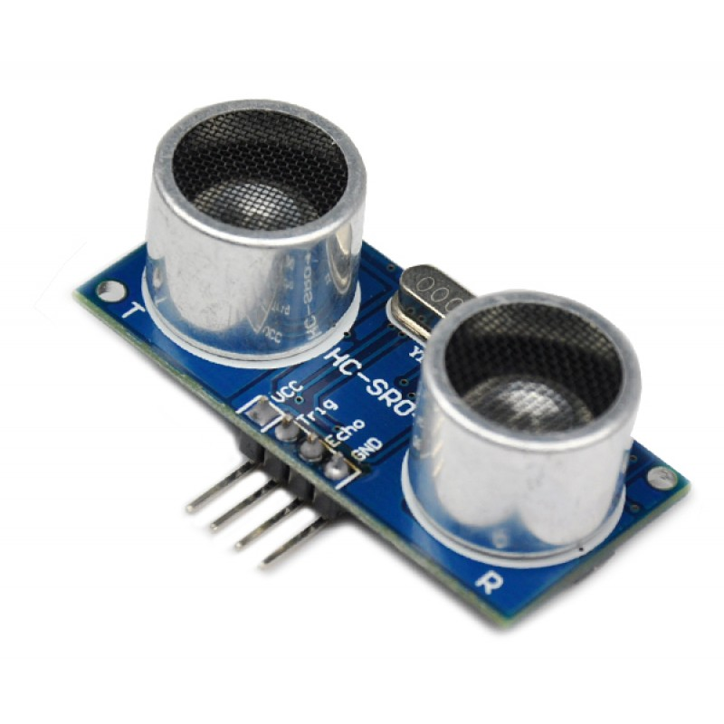

c++ [ROS](http://www.ros.org/) node wrapper for a set of [hc-sr04](http://www.micropik.com/PDF/HCSR04.pdf) ultrasonic sonars.



Publishes [sensor_msgs::Range](http://docs.ros.org/jade/api/sensor_msgs/html/msg/Range.html) messages at 10Hz to `/sonarN` topics. Specifically populates `range`.

We include a node for a set of sonars, rather than a node per sonar, since we need to ensure only one sonar is measuring at a time (sonars can easily interfere with each other)

on rasp pi 2 uses ~2% cpu and <1% mem for 3 sonars (capping at a distance of 20cm)

````
rostopic echo /sonar_0
---
header:
  seq: 525
  stamp:
    secs: 1462946345
    nsecs: 463606605
  frame_id: ''
radiation_type: 0
field_of_view: 0.0
min_range: 0.0
max_range: 20.0
range: 7.08620691299
---
````		    

TODOS
* need some analysis on `field_of_view`